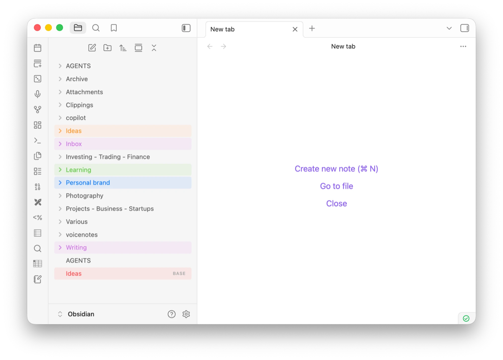

# Color Tags

Tag folders and notes with color from the file explorer's right-click menu, using
the seven colors macOS Finder uses for its tags.



## Why this exists

Plenty of plugins will color your file explorer. Most of them do it by stacking
their own CSS on top of your theme — a pill shape here, a border there — and the
result is that a colored item stops looking like it belongs in the list.

Color Tags is built the other way around. It sets Obsidian's own `--nav-item-*`
custom properties on the row and then gets out of the way, so Obsidian paints the
resting, hover, active and selected states itself, with your theme's radius,
padding and spacing. A tagged row and an untagged row are identical in every
dimension — only the color differs.

## Features

- **Seven Finder colors.** The same palette macOS uses, so a red folder here reads
  the same as a red folder in Finder.
- **Tint, not decoration.** The item's name is colored, with a subtle wash behind
  the row. No dots, no badges, no pills.
- **Folder chevrons take the color too**, so they stay legible against the tint.
- **Your theme is left alone.** Nothing about a row's shape, size or spacing
  changes when you tag it.
- **Tags follow their files.** Rename a note, move it, rename a whole parent
  folder — the color goes with it, including everything nested inside.
- **Works everywhere Obsidian does.** Desktop and mobile; mobile gets a swatch
  picker dialog instead of a submenu.

## The colors

| | Name | Hex |
| --- | --- | --- |
| 🔴 | Red | `#FF5257` |
| 🟠 | Orange | `#FF9A34` |
| 🟡 | Yellow | `#FFC72C` |
| 🟢 | Green | `#64C947` |
| 🔵 | Blue | `#0A7AFF` |
| 🟣 | Purple | `#CC73E1` |
| ⚪ | Gray | `#A6A6A6` |

## Usage

1. Right-click a folder or note in the file explorer.
2. Hover **Color tag** and pick a color.
3. To clear it, right-click again → **Color tag** → **Remove color**.

## Installing

### Community plugins

Not yet listed — the submission is in review. Until it lands, use one of the
options below.

### BRAT

Install [BRAT](https://obsidian.md/plugins?id=obsidian42-brat), then add
`markosnarinian/obsidian-color-tags` as a beta plugin. BRAT keeps it updated as
new releases ship.

### Manual

1. Download `main.js`, `manifest.json` and `styles.css` from the
   [latest release](https://github.com/markosnarinian/obsidian-color-tags/releases/latest).
2. Put all three in `<your-vault>/.obsidian/plugins/color-tags/`.
3. Enable **Color Tags** in Settings → Community plugins.

Release assets carry build provenance attestations, so you can confirm they were
built from this repository by its release workflow before installing:

```bash
gh attestation verify main.js -R markosnarinian/obsidian-color-tags
```

## Notes

**This plugin does not read or write real macOS Finder tags.** It borrows Finder's
palette because those colors are familiar, but the tags live in your vault, not in
the filesystem. Nothing on disk is modified, and the plugin behaves identically on
Windows, Linux and mobile.

Tags are stored in the plugin's own `data.json`, keyed by vault path. Your notes'
contents are never touched.

## Development

```bash
npm install
npm run dev    # watch build
npm run build  # type-check, then emit a minified main.js
```

Source lives in `src/`. The `main.js` at the repo root is a build output — it is
not tracked in git, and ships as a GitHub release asset.

## Credits

Color Tags is a fork of [**Color Marker**](https://github.com/ruisloan/obsidian-color-marker)
by **Central Brain Trust** ([centralbraintrust.com](https://www.centralbraintrust.com)),
released under the MIT license. The context-menu integration, path-keyed storage
and rename/move tracking are its work, and this fork would not exist without it.

This fork swaps in the macOS Finder palette, drops the colored dot, stops the
plugin from altering the shape of file explorer rows, tints folder chevrons, and
moves the source to TypeScript.

## License

MIT — see [LICENSE](LICENSE). The original author's copyright is retained
alongside this fork's.
